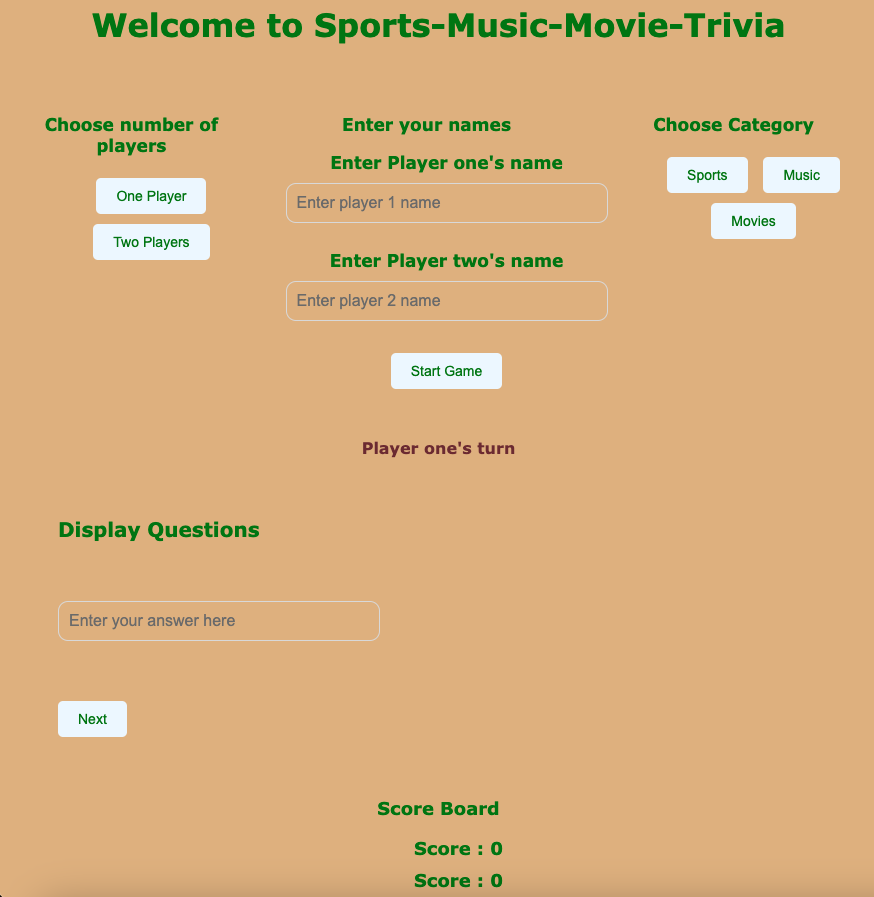

# Sport/Music/Movies Trivia

### Background Information

I chose this game because I am a big fan of sports, music and movies. This is a sport, music, and movies trivia game that allows the user to choose a category and and answer questions in that category. The user receives 10 points with every correct question. This is a single player and a two-player user game. for the single player, there is no winner, just point accumulation. for two players, there is a winner, loser, or it can be a tie.

### Getting Started

[Deployed game]()
[Planning material]()

### Technologies Used

HTML 
CSS
JAVASCRIPT
GITHUB

### References

[HTML audio](https://www.w3schools.com/html/html5_audio.asp)
[disable input](https://stackoverflow.com/questions/12896698/how-to-disable-an-input-field-using-javascript)
[if else statement on one line](https://stackoverflow.com/questions/30179850/one-line-if-else-in-javascript)
[Player takes turn](https://stackoverflow.com/questions/32537168/make-players-take-turns-playing-tic-tac-toe-in-javascript)
[Math.random with loop](https://stackoverflow.com/questions/41206642/javascript-math-random-in-a-for-loop)
[Filter array of nested objects](https://stackoverflow.com/questions/38375646/filtering-array-of-objects-with-arrays-based-on-nested-value)
[text content vs value](https://teamtreehouse.com/community/value-vs-textcontent)
